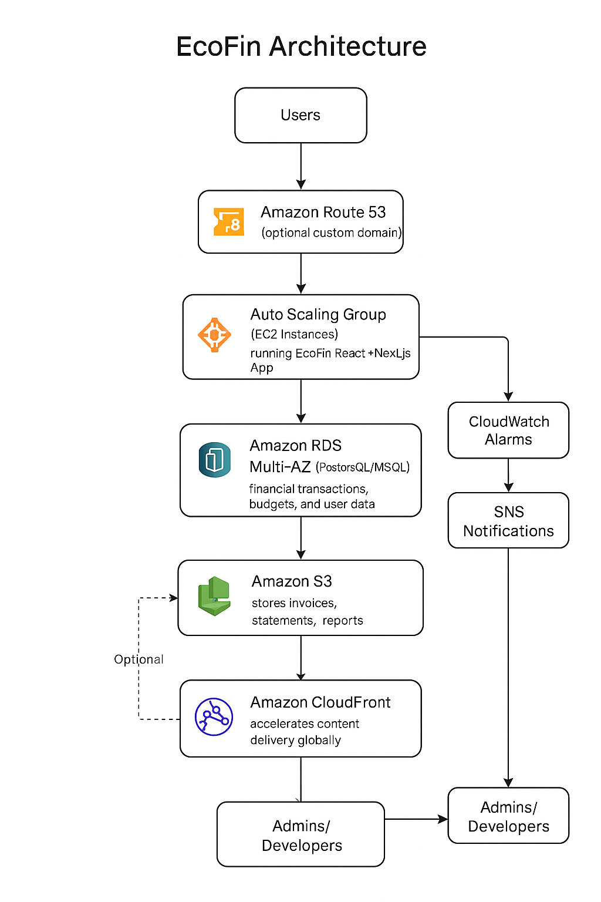

# TripSync

A React Native app for collaborative travel itinerary planning with shared calendars.

## Features
- Group trip planning and shared itineraries
- AWS DynamoDB for storing itineraries, destinations, schedules
- S3 for travel documents (tickets, PDFs, photos)
- CloudFront for fast global access
- Cognito for secure authentication and collaboration
- Lambda for auto-generated reminders (flight times, hotel check-ins)
- SNS for group notifications

## AWS Architecture
- EC2-based deployment for the web app
- Application Load Balancer (ALB) for traffic distribution
- Auto Scaling Group (ASG) for scalability and high availability
- Optional Amazon RDS (MySQL/PostgreSQL) for backend database
- IAM for role-based access
- CloudWatch & SNS for monitoring and alerts

## AWS Deployment Details

### Scalable Web Application with ALB and Auto Scaling
- **Architecture:** EC2-based
- **Description:**
  Deploy a simple web application on AWS using EC2 instances, ensuring high availability and scalability with Elastic Load Balancing (ALB) and Auto Scaling Groups (ASG). The project demonstrates best practices for compute scalability, security, and cost optimization.

#### Key AWS Services Used
- **EC2:** Launch instances for the web app.
- **Application Load Balancer (ALB):** Distributes traffic across multiple instances.
- **Auto Scaling Group (ASG):** Ensures instances scale based on demand.
- **Amazon RDS (Optional):** Backend database (MySQL/PostgreSQL) with Multi-AZ.
- **IAM:** Role-based access to instances.
- **CloudWatch & SNS:** Monitor performance and send alerts.

#### Learning Outcomes
- Setting up secure and scalable EC2-based web applications.
- Implementing high availability using ALB and ASG.
- Optimizing costs and performance using Auto Scaling policies.

---
*For step-by-step deployment instructions, see `/docs/aws-deployment.md`.*

## Architecture Overview

The TripSync application is designed for scalability, security, and high availability using AWS services:

- **Frontend:** React Native mobile app for collaborative travel planning.
- **Backend:** AWS Lambda functions for business logic, reminders, and notifications.
- **Authentication:** Amazon Cognito for secure user management and collaboration.
- **Data Storage:**
  - DynamoDB for itineraries, destinations, and schedules
  - Amazon S3 for travel documents (tickets, PDFs, photos)
  - (Optional) Amazon RDS for relational data needs
- **Networking & Delivery:**
  - Application Load Balancer (ALB) distributes traffic to EC2 instances
  - Auto Scaling Group (ASG) ensures backend scales with demand
  - CloudFront delivers fast, global access to itineraries and documents
- **Monitoring & Alerts:**
  - CloudWatch for performance monitoring
  - SNS for group notifications and system alerts
- **Security:** IAM roles for fine-grained access control

---
*See `/docs/aws-deployment.md` for deployment steps and architecture diagrams.*

## Getting Started
1. Install dependencies: `npm install`
2. Run on Android: `npx react-native run-android`
3. Run on Windows: See [React Native Windows Guide](https://aka.ms/ReactNativeGuideWindows)

## Deployment
See `/docs/aws-deployment.md` for EC2, ALB, and ASG setup instructions.

---
*This project demonstrates best practices for compute scalability, security, and cost optimization on AWS.*

# Troubleshooting

If you're having issues getting the above steps to work, see the [Troubleshooting](https://reactnative.dev/docs/troubleshooting) page.

# Learn More

To learn more about React Native, take a look at the following resources:

- [React Native Website](https://reactnative.dev) - learn more about React Native.
- [Getting Started](https://reactnative.dev/docs/environment-setup) - an **overview** of React Native and how setup your environment.
- [Learn the Basics](https://reactnative.dev/docs/getting-started) - a **guided tour** of the React Native **basics**.
- [Blog](https://reactnative.dev/blog) - read the latest official React Native **Blog** posts.
- [`@facebook/react-native`](https://github.com/facebook/react-native) - the Open Source; GitHub **repository** for React Native.
